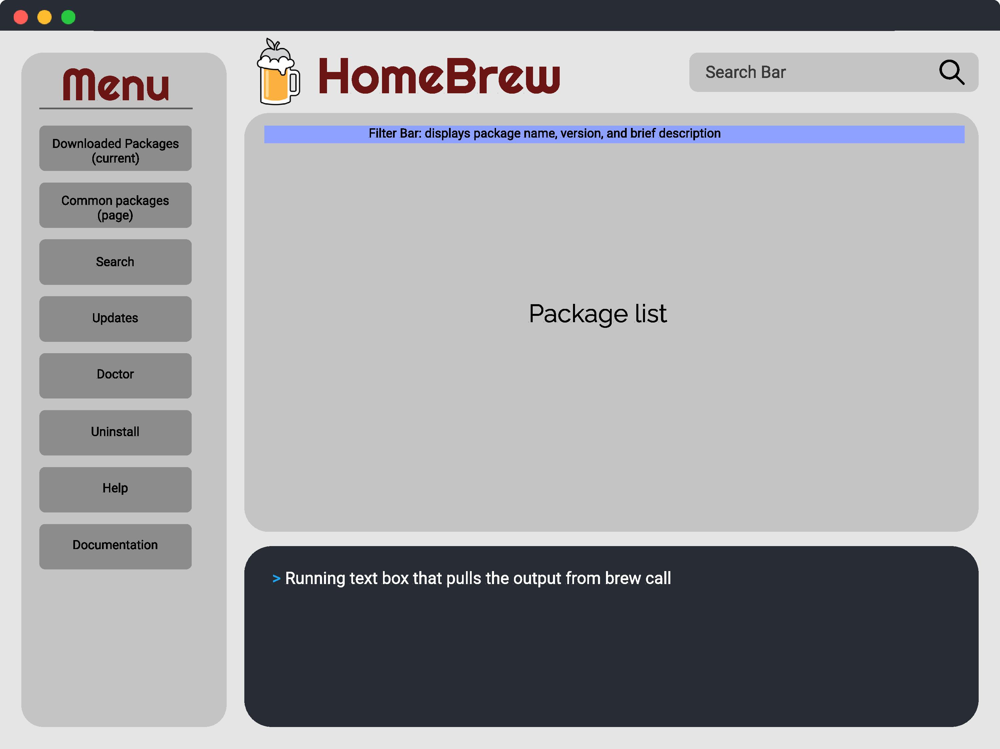
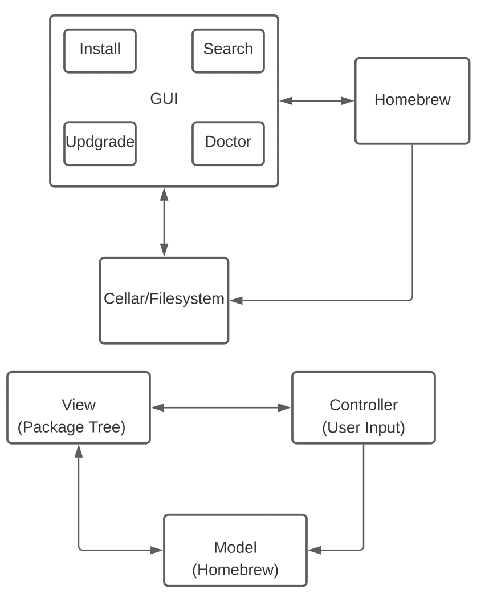
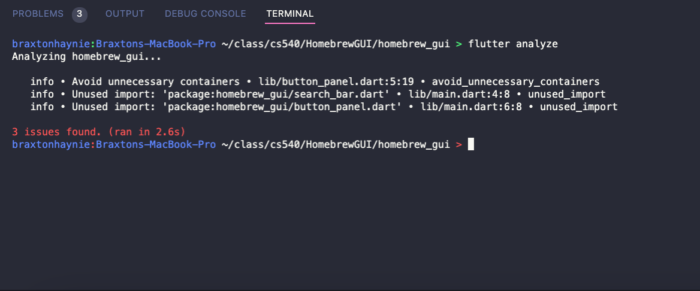

# Homebrew GUI
### Team: Vishal Aiely, Braxton Haynie, Colter Swanson
---

## Introduction
- Overview

    This project is going to be intuitive easy to use GUI for the MacOS and Linux package manager Homebrew. The idea is to make a easy to use interface that also looks appealing to the users. The motivation for the project is to help make using homebrew easier and arguably less daunting for new user. It would also be nice to help the user visualize what packages have been downloaded by Homebrew. Another feature that would be useful to have is the ability to search packages based on their functionality not just their name.

    There is a GUI that has been created for Homebrew already, so this idea is not entirely original. However, the other GUI that is available does not allow for descriptive package search. Another big difference will be how the application will be developed. Our team will be using dart and flutter to develop the application, and the other GUI was developed using Objective-C and xCode. A key feature that we hope to add is the ability for our Homebrew GUI to be compatable with both MacOX and Linux.

## Customer Value
- Customer Need

    The primary customer for our Homebrew GUI are other software developers looking to find an easy way to manage their packages. The main want that our GUI will be addressing is the desire to have an easy to use functional interface that will allow developers to devote less time and effort to their package management. Providing users with an interface to help with package management will allow them to easily view the packages they have installed and a list of packages that can be installed. By providing this for the developer, they will be able to focus more on their code development and less on learning the nuances behind package management. 
    
- Proposed Solution

    In the eyes of our customers, our product will deliver an easy to use, visually appealing interface that will allow for ease of access to packages already installed and ones that could be installed. The main benefit from this product will be the time that will be saved getting used to using Homebrew in the command line. Instead, the interface will be clear enough and easy enough to use that the customer will be able to spend more time on their actual project and less time on the setup of their project. The product that we will be developing will provide a new search feature to homebrew that is currently not available and will make Homebrew faster, easier, and more navigable for new users. Our idea currently has not been tested on any individuals yet, however, we have had some peers show interest in our product. Once we have an initial build of the GUI we plan to test it using these individuals and some of our other peers. 
    
- Measures of Success

    Since our product will not deliver many different services to the user and instead focus on usability, we hope to gather feedback through a rating system on the users experience using the interface. This will allow us to measure our success by viewing user feedback and their ratings to better improve our product. We will focus on the customers' views on the usability of the product and how much time our product saved them. 

## Proposed Solution & Technology
- System

    The software will ultimately try to help the user to more easily use Homebrew and make it clear and concise as to what it is doing. There will be two main components of the code. There will be the code that runs the UI, and the code that calls and manages what homebrew is doing. A minimal system that would have value to a user would be a simple GUI that could be used to see what packages Homebrew has installed, and it would also allow the user to install new packages at the click of a button. In the early stages of development, we will be testing the application ourselves by simply running it and trying out commands. Once we get farther along in the development, we hope to get other users to help us test the application and provide feedback.

- Tools

    The tools that will be used in the project are all open source and readily available to use along with extensive documentation. The tools that will be used are:
    - Homebrew -- The package manager the GUI is being created for
    - Flutter -- An open source SDK and UI library that is being used to create the UI 
    - Dart -- Programming language that is being used on the project

## Use Case 1: Find Package using description
A user is attempting to find a specific package (terminal tool) that allows them to perform a task that they otherwise would not be able to complete. The user knows that they are looking for something to allow them to execute a type of file. Through the use of the search bar in HomebrewGUI, the user is able to type in the file type and the words 'compiler' or 'interpreter' which showcases a list of relevant packages/programs that the user can install. The user finds a package that has a description stating that it can run said file type. The user can easily click the `install` button and use the command in their terminal to run the file.

## Test Case
A test case for our application is testing whether someone is able to manage the packages that they have efficiently, without the need to memorize terminal commands to do so. We can test whether our application properly displays all of the packages that are currently installed via Homebrew on the host's machine. Then we can test whether searching for and uninstalling a particular package can be completed using the user interface. Afterward, we can test to see if the package has been properly removed by testing to make sure it is not accessible in the terminal and that the files associated with it are deleted. Finally, we can also test if the user interface allows someone to search for the uninstalled package and reinstall it back. These test cases can validate that our application provides the necessary tools that a user would need to interact with Homebrew.

## Initial Design Mockup

## Architectural Diagrams

## Project Measurement Examples
---
#### Feature Burndown Chart
This chart details our progress of implementing features over the lifetime of this project.

#### Time per Action
This chart showcases an approximation of the time it would take a new user to accomplish certain predefined actions.

## Static Analysis Example

## Deployment Overview

#### Deployment Options

1. Clone the repository
2. Add a fully built application to the App Store for MacOS and the Snap store for Linux.
3. Create a formula for brew to allow the tool to be installed via Homebrew.

The easiest form of deployment for us as developers would be to keep the tool solely in Github and force users to clone the repository to use the application. The other two forms of deployment would take a bit more work to do. Getting the tool added to the App Store would require us to purchase a subscription to the Apple development program in order to publishing the tool. If we were to seek further development of this tool, then it would probably be worth getting a subscription to this service to publish the tool and make it more easily accessable. The last form of deployment would probably be the best approach for us given the nature of what the tool is supposed to do and help with. This form of deployment would only require following the brew formula guide to create a formula and some knowledge of Ruby.

#### Current Issues

- With the tool not being fully developed it would not be accepted into the App or Snap store.
- Readme is not fully complete with instructions on how to run the tool for those who clone the repository.

## Team
- Skills

    Designing a user interface is not new to the team members of this team. All of us have some experience designing and implementing 
    UI's. However, our experience is mainly with pyQT and other UI development tools. This will be the first time each of us is using 
    Flutter and thus will be expecting a learning curve while developing the UI. 
- Roles

    The roles for our team will include a project manager and two frontend developers. The role of project manager will go to Braxton Haynie as 
    he was the one that formed the project and has led the initial deign process. He will be tasked with keeping the project on track and 
    managing the overall flow of the project. Since this project is a frontend project, there will be two frontend developers, Vishal Aiely and Colter
    Swanson. They will be responsible for the layout of the user interface and how well it will communicate its features to the customer. The role of
    tester will also be assigned. It will be assined as a rotating role among the three people on this project. The other roles assigned are fixed unless 
    conflict arises later on in the project and change is needed. 

## Project Management
- Schedule

    The schedule consists of first identifying the problem we want to solve by building our tool, and then by figuring out whether our idea solves the problem. We will accomplish these first stages by creating some initial design mock-ups and technical architectures to showcase the functionality of the system. Then we will present these designs to potential users in order to get feedback which will help us understand to which extent our solution solves the root problem. This entire process will be completed within the begin weeks of the project (2/13-3/6). Afterwards, we will refine our problem and solution definition to better suit the feedback given by our initial user. We will begin to develop a backend that allows us to download and search through existing packages within the homebrew ecosystem. As we are developing out initial backend, we will be finalizing a mid-fidelity design mock-up that will be slightly more representative of the final look of the project. These stages will be completed in the weeks of 3/7-3/20. Then the final stage of the product will be modifying the user interface to match the new design and connecting it to the backend, these portions should be completed from 3/21-4/10.    
    
    The system, as we see now, is definitely feasible from a technical and design standpoint.
    
    To ensure proper progress is being made towards a final solution, we will meet weekly over Discord.
    
    The tentative week-by-week schedule for the past and near future weeks are listed in the table below:
    
    | Week | Tasks                                                                          |
    |------|--------------------------------------------------------------------------------|
    | 2/13 | Finish Proposal, Begin UI Design                                               |
    | 2/20 | Created a Use Case & Setup Repo|
    | 2/27 | Diagram of Architecture |
    | 3/6  | Mockup design of User Interface|
    | 3/13 | Implemented Side Panel and Search Bar UI|
    | 3/20 | Created a Test Case, Restructured Layout, Added and Formatted Necessary Buttons|
    | 3/27 | Created Dynamic Scrollable File View, Example of Pull Request|
    | 4/3  | Static Analysis Example, Connected app to Cellar File System, Directory Checking |
    | 4/10 | Connected Search Bar to Homebrew Calls, Project Measurement Examples, Added Brew Doctor Functionality |
    | 4/17 | Added Install Capabilities, Update API functionality, Deployment Example |
    | 4/24 | Documentation API |
    | 5/1  | Created Final Presentation, Finished up Button Functionailies |
    | 5/8  | Created Final Project Report |

- Constraints

    The tools and programs that our project are based on are protected by open-source licenses. Therefore, we must respect the license agreements under the BSD 2-Clause License for modifying Homebrew. Since our technology is an extension of an existing tool and is used to enhance the user experience of the tool, there is not any major ethical or social concern we foresee.
    
- Resources

    The packages and data belonging to those packages should be accessable as they are avialable for download via the Homebrew package manager.
    
- Descoping

    If we cannot complete the full functionality of the tool, we should still be able to showcase information about package and let users view the downloaded packages. Some functionality such as full-text search for package descriptions may be more difficult to implement and would not be entirely essential for a partially functioning product. This tool will still be useful to users as it gives them a visual method by which packages can be inspected.

## Process Selection

The process that was selected for the development of the Homebrew GUI tool is the iterative process. The iterative code development process is an agile-like process in which each iteration is a week or two with a design-build-test cycle approach. These short iterations allow for customer feedback to be readily applied to the next iteration. For our project, feedback will come from other computer science majors to better understand what should be done in the next iteration. The iterative design process also allows for testing at the end of each iteration, unlike the waterfall method. The waterfall method tests only towards the end of the project. The issue with testing being performed this late is that it makes it highly likely that bugs will be missed. This is not an ideal situation for any project; however, it is especially not ideal for the project in this class due to a fairly strict deadline. If bugs are left to the end of the course, the project could be in jeopardy of not being completed at all. 

Another development process that was considered was the V process which uses a level approach to design and testing. The appeal of this process was the two fold approach of designing and testing the project on the fly. However, the big disadvantage of this approach is that it is eerily similar to the waterfall approach with how it can be difficult to adapt to requirements changes. This difficulty of not being able to easily adapt the project to requirement changes and the issues with late testing is why the team settled on using the iterative process of development because of its safeguards from these issues.

## Lessons Learned & Future Work

In the future we would like to develop the terminal widget to display output for different calls. This would allow for the output of what is usually displayed in the terminal when running brew calls to allow users that are unfamiliar with terminal to gently ease their way into it. The terminal widget would also allow for input to allow for more advanced brew calls. We would also like to add descriptions to the packages that are displayed in the main window and the common packages feature. This would allow for new users to easily distinguish between packages and their functionality. Overall polishing of the app would be needed as well. Since this is simply a proof of concept, the overall design would need to be polished more for it to be a finished product.

Over the course of the Hombrew GUI app development, we learned how to use the  flutter SDK and the programming language Dart. We also learned how to properly manage the development of a software application using the common industry style of agile development. 
